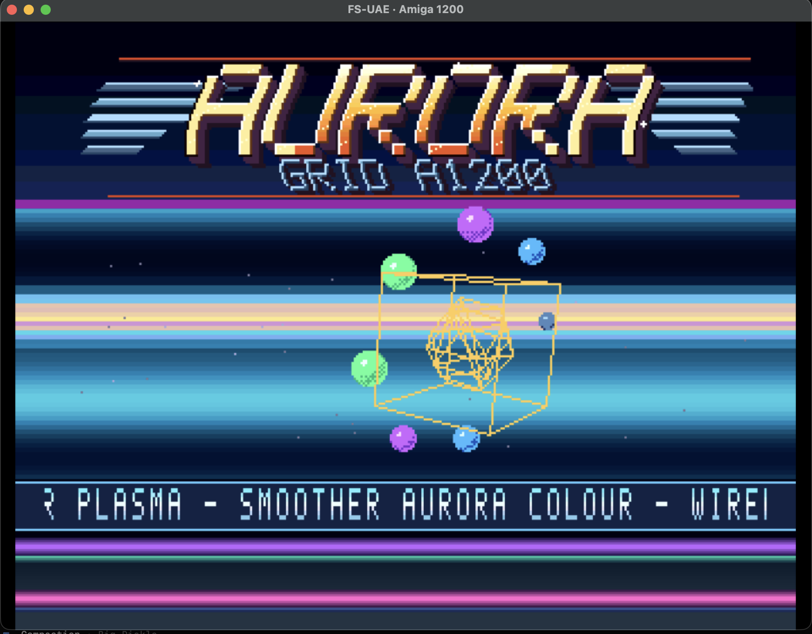

# Aurora Grid A1200

**Aurora Grid A1200** is a self-contained PAL AGA demo for Amiga 1200/4000-class machines, written in Motorola 68000 assembly with deterministic Python asset generation.

It combines a generated four-bitplane logo, AGA 24-bit Copper gradients, wireframe 3D, sprite balls, a starfield, floor bars, a scroller, and a generated four-channel ProTracker module. The executable checks for AGA before taking over the custom chips and exits cleanly on unsupported machines.



## Highlights

- AGA-only PAL demo for Amiga 1200/4000.
- Safe startup path with chipset gate before hardware takeover.
- 24-bit AGA Copper plasma using `BPLCON3` high/low colour writes.
- Procedural `AURORA / GRID A1200` logo generated from source.
- Smooth logo wave, glint, plasma flash, travelling bars and floor colour motion.
- Starfield with depth classes and reciprocal-table projection.
- Blitter-drawn wireframe cube, octahedron, cuboctahedron and tunnel scenes.
- Eight hardware sprite balls with shaded prebuilt frames.
- Generated ProTracker module with bass, lead, pad/arpeggio and drums.
- Host-side validation for asset sizes, hunk structure, chip-RAM relocation assumptions and 68000 source rules.

## Screenshots

### FS-UAE A1200 smoke test


### Generated logo preview


## Build

```sh
make validate
make verify-repro
make
```

The full build requires `vasmm68k_mot` on `PATH` or at `tools/bin/vasmm68k_mot`.

Output:

```text
build/aurora_grid_a1200
```

If you do not have VASM installed, either install `vasmm68k_mot` yourself or provide a VASM source tree under `tools/vendor/vasm` and run:

```sh
make toolchain
make
```

## Run

Use an A1200/AGA PAL emulator profile. A minimal FS-UAE setup can mount the repository or a small directory hard drive containing the built executable:

```ini
[fs-uae]
amiga_model = A1200
kickstart_file = internal
hard_drive_0 = /path/to/boot-hd
hard_drive_0_label = AURORA
window_width = 960
window_height = 720
fullscreen = 0
```

Example `S/Startup-Sequence`:

```text
aurora_grid_a1200
```

Left mouse exits the demo and returns to the system.

## Assets and generated data

All generated assets are deterministic:

- `assets/logo.raw` — planar four-bitplane logo bitmap.
- `assets/logo_preview.png` — preview of the generated logo.
- `assets/font.raw` — scroller font.
- `assets/aurora.mod` — generated ProTracker module titled `AURORA GRID A1200`.

Regenerate assets:

```sh
make assets
python3 tools/generate_assets.py
```

Generate individual assembly tables:

```sh
python3 tools/gen_tables.py logo_face
python3 tools/gen_tables.py plasma_pal
python3 tools/gen_tables.py copper
```

## Validation

Current local validation includes:

```sh
make validate
python3 tools/verify_repro.py
make
python3 tools/make_manifest.py
shasum -a 256 -c MANIFEST.sha256
git diff --check
```

The project was also smoke-tested visually in FS-UAE 3.2.35 with an A1200/internal-ROM configuration.

## Compatibility

- PAL timing is the target.
- AGA is required; OCS/ECS machines are rejected.
- Code is assembled as 68000-compatible (`-m68000`) while targeting A1200/A4000 AGA hardware.
- Real hardware testing should be performed before any “hardware verified” claim.

## Documentation

- `docs/ARCHITECTURE.md` — startup, chip-RAM relocation, frame loop and DMA ownership.
- `docs/GFX.md` — display bands, bitplanes, Copper effects and rendering pipeline.
- `docs/BUILD_AND_TEST.md` — validation matrix and emulator/real-hardware checklist.
- `docs/CURRENT_AUDIT.md` — current audit findings and release gates.
- `docs/MUSIC.md` — generated MOD/music notes.
- `docs/VALIDATION.md` — validator design and historical bug coverage.

## License

GPL-3.0-or-later. See `LICENSE`.
